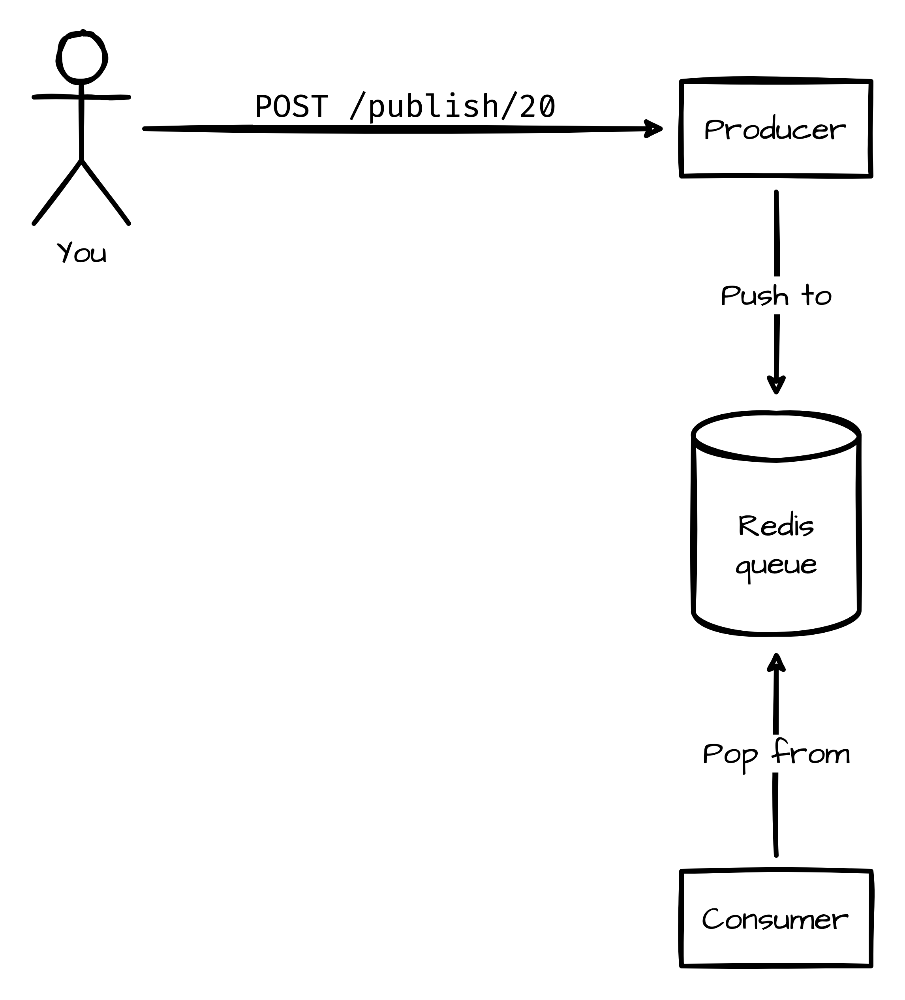
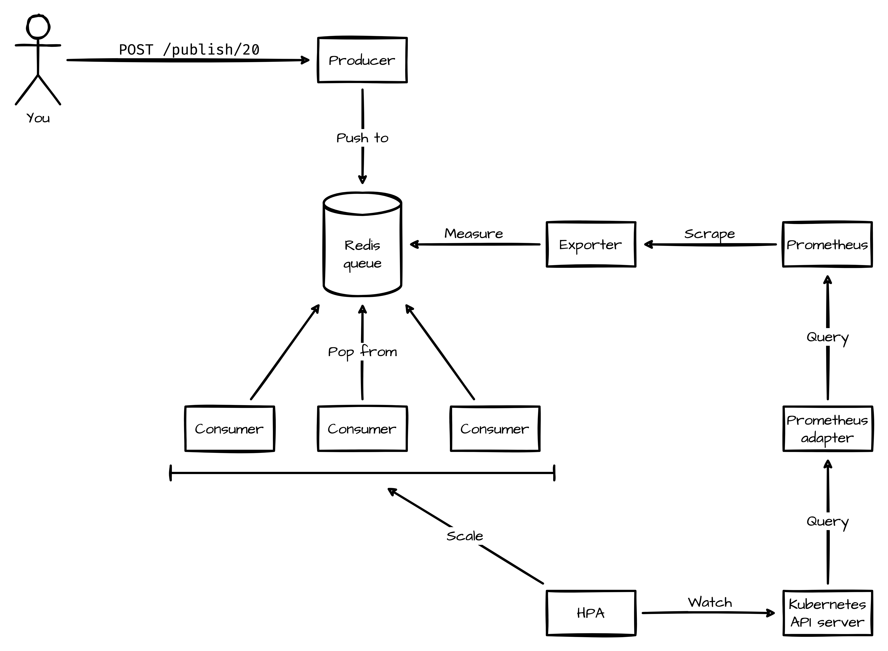

# Dojo ~ Kubernetes Autoscaling with Prometheus

In this dojo, you will learn to use custom metrics to scale a service deployed
in a Kubernetes cluster. You will even scale the service down to zero instances
when possible, to avoid wasting resources.

## Step 1: Install the tools you will need

For this exercise, you will need :

- [`docker`](https://docs.docker.com/get-docker/)
- [`kubectl`](https://kubernetes.io/docs/tasks/tools/)
- [`kind`](https://kind.sigs.k8s.io/docs/user/quick-start/#installation)
- [`helm`](https://helm.sh/docs/intro/install/)
- [`jq`](https://stedolan.github.io/jq/)

## Step 2: Bootstrap the environment

> Make sure Docker is running on your computer. Otherwise, none of this will
> work.

Create a local Kubernetes cluster with the exercise ready:

```bash
./scripts/bootstrap.sh
```

## Step 3: Explore the environment

You now have a Kubernetes cluster running on your machine. Have a look at what
is inside:

```bash
kubectl get pods -A
```

An application is deployed to the `default` namespace. It has a simple
event-driven architecture:

1. Users send requests to the producer.
2. The producer pushes items to a queue stored in a Redis instance.
3. A consumer pops items from the queue.
4. The consumer does some work for each item.



Try it out! First, tell the producer to publish a message:

```bash
curl -X POST producer.vcap.me/publish
# or
http POST producer.vcap.me/publish
```

Now check the consumer's logs:

```bash
kubectl logs -l app.kubernetes.io/name=consumer
```

Notice that the consumer takes 1 second to process an item from the queue.
Now, publish 10 messages at once:

```bash
curl -X POST producer.vcap.me/publish/10
# or
http POST producer.vcap.me/publish/10
```

The consumer's logs show that it only processes one item at a time. By adding
more instances of the consumer, your application can process items faster.
Scale the consumer to 3 instances:

```bash
kubectl scale deployment consumer --replicas=3
```

Now publish 10 messages again. By watching all of the consumers' logs at once,
you should see that they can each process an item at a time. Your application
now has 3 times the throughput!

## Step 4: Understand the target architecture

You might have guessed that you are going to scale the number of consumer
instances based on the number of items waiting to be processed. If you did, you
are right!

Let's walk through how you are going to do this.

First, you need to deploy a monitoring system to measure the length of your
Redis queue. You are going to do this with Prometheus and the Redis exporter.

Second, you need to expose this metric inside the Kubernetes API. The native
Kubernetes pod autoscaler does not know how to query Prometheus. You are going
to use the Prometheus adapter to serve as a bridge between the Kubernetes API
server and Prometheus.

Finally, you are going to deploy a horizontal pod autoscaler that will set the
number of replicas of your consumer based on the metric found in the Kubernetes
API.

This is what the target architecture looks like:



## Step 5: Deploy Prometheus

The simplest way to deploy Prometheus to your cluster is with the
[prometheus-community/kube-prometheus-stack](https://github.com/prometheus-community/helm-charts/tree/main/charts/kube-prometheus-stack)
Helm chart.

Here is what you need to do:

1. Set Prometheus's scrape interval to 5s.
2. Make Prometheus watch all Rules and ServiceMonitors in the cluster.
3. Create an Ingress for Prometheus with the `prometheus.vcap.me` hostname.
4. Deploy Prometheus to the `prometheus` namespace.
5. Go to the Prometheus UI: http://prometheus.vcap.me.

Ready? Set. Go!

<details>
  <summary>Hint n°1</summary>
  
  Have a look at the chart's `values.yml` file. Everything you need is in there.
</details>

<details>
  <summary>Hint n°2</summary>
  
  You can configure Prometheus with the `prometheus.prometheusSpec` field.
</details>

<details>
  <summary>Hint n°3</summary>
  
  Setting `matchLabels` to an empty object makes it match everything.
</details>

<details>
  <summary><em>
    Compare your work to the solution before moving on. Are there differences? Is your approach better or worse? Why?
    </em></summary>
  
  You can find this step's solution here:
  
  - [solution/scripts/deploy-prometheus.sh](./solution/scripts/deploy-prometheus.sh)
  - [solution/helm/values/prometheus.yaml](./solution/helm/values/prometheus.yaml)

</details>

## Step 6: Deploy the Redis exporter

The easiest way to deploy the Redis exporter is with the
[prometheus-community/prometheus-redis-exporter](https://github.com/prometheus-community/helm-charts/tree/main/charts/prometheus-redis-exporter)
chart.

Here is what you need to do:

1. Configure the chart to create a ServiceMonitor for the exporter.
2. Configure the exporter to connect to the `redis-master` Service.
3. Configure the exporter to watch a single key: `padok`.
4. Deploy the exporter to the `default` namespace.
5. See your application activity in the Prometheus UI with this query:

   ```promql
   rate(redis_commands_processed_total{service="prometheus-redis-exporter",namespace="default"}[20s])
   ```

You can do it!

<details>
  <summary>Hint n°1</summary>
  
  Have a look at the chart's `values.yml` file. Everything you need is in there.
</details>

<details>
  <summary>Hint n°2</summary>
  
  Have a look at the exporter's [GitHub repository](https://github.com/oliver006/redis_exporter).
</details>

<details>
  <summary>Hint n°3</summary>
  
  Did you notice the `REDIS_EXPORTER_CHECK_SINGLE_KEYS` variable?
</details>

<details>
  <summary><em>
    Compare your work to the solution before moving on. Are there differences? Is your approach better or worse? Why?
    </em></summary>
  
  You can find this step's solution here:
  
  - [solution/scripts/deploy-prometheus-redis-exporter.sh](./solution/scripts/deploy-prometheus-redis-exporter.sh)
  - [solution/helm/values/prometheus-redis-exporter.yaml](./solution/helm/values/prometheus-redis-exporter.yaml)

</details>

## Step 7: Create a Prometheus rule

The Redis exporter has a feature that is going to be a problem for you: when
your Redis queue is empty, the exporter does not expose a metric for it. See for
yourself:

1. Run this query in the Prometheus UI:

   ```promql
   redis_key_size{service="prometheus-redis-exporter",namespace="default",key="padok"}
   ```

2. Publish a small number of items to your queue.
3. See how the metric exists when there are items in the queue, but not when the
   queue is empty.

Here is what you need to do to work around this:

1. Add a PrometheusRule resource to the `consumer` chart.
2. In the rule, define a new metric called `redis_items_in_queue`.
3. In the rule, write a PromQL query that makes it so that:
   1. When `redis_key_size{service="prometheus-redis-exporter",namespace="{{ .Release.Namespace }}",key="padok"}`
      exists, `redis_items_in_queue` has the same value and labels.
   2. When `redis_key_size` is null, `redis_items_in_queue` has a value of 0
      with the following labels:
      `{service="prometheus-redis-exporter",namespace="{{ .Release.Namespace }}",key="padok"}`
4. Update the `consumer`'s release (there's a script for that).
5. Check that this query returns a value whether the queue is empty or not:

   ```promql
   redis_items_in_queue{service="prometheus-redis-exporter",namespace="default",key="padok"}
   ```

What are you waiting for?

<details>
  <summary>Hint n°1</summary>
  
  [This great blog article](https://www.padok.fr/en/blog/scaling-prometheus-rabbitmq#prometheus-rules)
  has an example of a PrometheusRule.
</details>

<details>
  <summary>Hint n°2</summary>
  
  Have a look at the `absent` and `clamp_max` Prometheus functions, and the `or`
  keyword.
</details>

<details>
  <summary>Hint n°3</summary>
  
  This is the PromQL query to use in your PrometheusRule:

```promql
redis_key_size{service="prometheus-redis-exporter",namespace="default",key="padok"}
or
clamp_max(absent(redis_key_size{service="prometheus-redis-exporter",namespace="default",key="padok"}), 0)
```

</details>

<details>
  <summary><em>
    Compare your work to the solution before moving on. Are there differences? Is your approach better or worse? Why?
    </em></summary>
  
  You can find this step's solution here:
  
  - [solution/helm/charts/consumer/templates/prometheusrule.yaml](./solution/helm/charts/consumer/templates/prometheusrule.yaml)

</details>

## Step 8: Deploy the Prometheus adapter

The easiest way to deploy the Prometheus Adapter is with the
[prometheus-community/prometheus-adapter](https://github.com/prometheus-community/helm-charts/tree/main/charts/prometheus-adapter)
chart.

Here is what you need to do:

1. Configure the adapter to query the existing Prometheus service.
2. Configure the adapter to expose all metrics starting with `redis_`.
3. Deploy the adapter to the `prometheus` namespace.
4. Read the number of items in your queue from the Kubernetes API :

   ```bash
   kubectl get --raw '/apis/custom.metrics.k8s.io/v1beta1/namespaces/default/services/prometheus-redis-exporter/redis_items_in_queue' | jq
   ```

Get to it!

<details>
  <summary>Hint n°1</summary>
  
  Have a look at the chart's `values.yml` file. Everything you need is in there.
</details>

<details>
  <summary>Hint n°2</summary>
  
  Have a look at [this documentation](https://github.com/kubernetes-sigs/prometheus-adapter/blob/master/docs/config.md).
  The introduction is very helpful. The *Discovery* and *Querying* might help
  you too.
</details>

<details>
  <summary>Hint n°3</summary>
  
  You need to define a custom rule. You only need to set the `seriesQuery` and
  `metricsQuery` fields. Forget `name` and `resources`.
</details>

<details>
  <summary><em>
    Compare your work to the solution before moving on. Are there differences? Is your approach better or worse? Why?
    </em></summary>
  
  You can find this step's solution here:
  
  - [solution/scripts/deploy-prometheus-adapter.sh](./solution/scripts/deploy-prometheus-adapter.sh)
  - [solution/helm/values/prometheus-adapter.yaml](./solution/helm/values/prometheus-adapter.yaml)

</details>

## Step 9: Add a horizontal pod autoscaler

This step is pretty self-explanatory. Here is what you need to do:

1. Add a v2beta2 HorizontalPodAutoscaler resource to the `consumer` chart.
2. Configure the HPA to scale the consumer's Deployment.
3. Set `minReplicas` to `1` and `maxReplicas` to `20`.
4. Scale the Deployment based on a metric of type `Object`.
5. Scale based on the `redis_items_in_queue` timeseries with the `key=padok`
   label.
6. Set a target average of 20 items per consumer replica.
7. Update the `consumer`'s release (there's a script for that).
8. Check that the number of consumers adapts to the number of items in the
   queue.

Are you ready? Go!

<details>
  <summary>Hint n°1</summary>
  
  [This great blog article](https://www.padok.fr/en/blog/scaling-prometheus-rabbitmq#hpa)
  has an example of a v2beta2 HorizontalPodAutoscaler.
</details>

<details>
  <summary>Hint n°2</summary>
  
  The Prometheus adapter mapped the metrics to Kubernetes resources. This
  mapping is based on the timeseries' labels.
</details>

<details>
  <summary>Hint n°3</summary>
  
  The metrics are mapped to the `prometheus-redis-exporter` Service.
</details>

<details>
  <summary><em>
    Compare your work to the solution before moving on. Are there differences? Is your approach better or worse? Why?
    </em></summary>
  
  You can find this step's solution here:
  
  - [solution/helm/charts/consumer/templates/horizontalpodautoscaler.yaml](solution/helm/charts/consumer/templates/horizontalpodautoscaler.yaml)

</details>

## Step 10: Scale to zero

Your local cluster has a special feature activated: your HPA can scale to 0
instances if you let it. Here is what you need to do:

1. Set the consumer's HPA's minimum to 0.
2. Update the `consumer` release.
3. Check that the HPA scales to 0 instances when the Redis queue is empty.

Easy, wasn't it?

If you haven't already, have a look at your HPA:

```bash
kubectl get hpa consumer
```

You should notice that there is something wrong with what is displayed.
-9223372036854775808 is a strange number. You might know that it is equal to
-2^63. But why is your HPA displaying this nonsensical value? Is this a bug in
`kubectl`?

Check your HPA's status directly, without `kubectl`'s user-friendly format:

```bash
kubectl get hpa consumer -o json | jq .status
```

The value is not there. There is a simple reason why. By default, `kubectl`
fetches your HPA from the `autoscaling/v1` API, instead of the
`autoscaling/v2beta2` API that we want to use. See for yourself:

```bash
kubectl get hpa consumer -o json | jq .apiVersion
```

Kubernetes translates between versions for you, so your HPA exists in both
versions. You can access specific API versions like this:

```bash
kubectl get hpa.v2beta2.autoscaling consumer -o json | jq .apiVersion
```

Check your HPA's status in the `autoscaling/v2beta2` API:

```bash
kubectl get hpa.v2beta2.autoscaling consumer -o json | jq .status
```

You should see the value there. The only way for this value to be in your HPA's
raw status is if the Kubernetes controller manager put it there. This seems like
a bug. Here is what you need to do:

1. Go the [kubernetes/kubernetes](https://github.com/kubernetes/kubernetes)
   repository.
2. Find the line that causes the bug.

Debugging Kubernetes. This should be fun!

<details>
  <summary>Hint n°1</summary>
  
  The controller manager's code is in the [pkg/controller](https://github.com/kubernetes/kubernetes/tree/master/pkg/controller)
  directory.
</details>

<details>
  <summary>Hint n°2</summary>
  
  The HPA computes its status in the [podautoscaler/replica_calculator.go](https://github.com/kubernetes/kubernetes/blob/master/pkg/controller/podautoscaler/replica_calculator.go)
  file.
</details>

<details>
  <summary>Hint n°3</summary>
  
  In Go, diving a floating value by 0 gives a special number: [math.NaN()](https://golang.org/pkg/math/#NaN).
  Casting this value to a 64-bit integer results in `-9223372036854775808`, as
  seen [here](https://play.golang.org/p/ZEzSZozeUci).
</details>

<details>
  <summary><em>
    Compare your work to the solution before moving on. Are there differences? Is your approach better or worse? Why?
    </em></summary>
  
  The bug is [right here](https://github.com/kubernetes/kubernetes/blob/617064d7327bf455955cb785d57330c425d48b51/pkg/controller/podautoscaler/replica_calculator.go#L300).
  The Kubernetes controller divides resource utilisation by the number of
  replicas to compute an average. When the number of replicas is 0, the
  Kubernetes controller divides by 0! 😱
</details>

## Cleanup

Once you are done with this exercise, you can destroy your local environment:

```bash
./scripts/teardown.sh
```

I hope you had fun and learned something!
